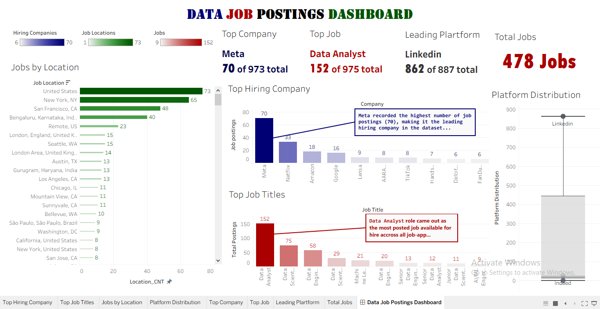

# 📊 Data Job Postings Analysis

An end-to-end data analytics project that transforms raw and unstructured job posting data into actionable insights. Using Python for data cleaning and exploratory data analysis (EDA), Microsoft Excel for final validation, and Tableau for interactive dashboard development, this project explores hiring trends across the data industry, including the most advertised job roles, top hiring companies, popular job locations, and leading recruitment platforms.

---

# 📌 Business Problem

Thousands of data-related job opportunities are posted across multiple recruitment platforms every day. For job seekers and career planners, it can be difficult to identify hiring trends, understand where opportunities are concentrated, and determine which organizations are actively recruiting.

This project analyzes data job postings to uncover meaningful insights that can help aspiring data professionals better understand the current hiring landscape.

---

# 🎯 Project Objectives
✔ Clean and prepare an unstructured job postings dataset.

✔ Analyze hiring trends within the data industry.

✔ Identify the most advertised data job roles.

✔ Discover the companies posting the highest number of vacancies.

✔ Analyze locations with the greatest demand for data professionals.

✔ Determine the most active recruitment platforms.

✔ Present findings through an interactive Tableau dashboard.

---

# 📂 Dataset Information

* **Dataset Name:** Data Jobs Dataset
* **Source:** Kaggle
* **Total Records:** 975 Job Postings
* **Final Columns:** 7

### Dataset Fields

* ID
* JobTitle
* Company
* Job_Location
* Link_Address
* Source
* Date_Posted

---

# 🛠️ Tools & Technologies

* Python
* Pandas
* Matplotlib
* NumPy
* Microsoft Excel
* Tableau
* GitHub

---

# 🔄 Project Workflow

```text
Raw Dataset (Kaggle)
        │
        ▼
Python
(Data Cleaning)

        │
        ▼
Microsoft Excel
(Data Validation & Final Structuring)

        │
        ▼
Python
(Exploratory Data Analysis)

        │
        ▼
Tableau
(Interactive Dashboard)

        │
        ▼
Business Insights & Recommendations
```

---

# 🧹 Data Cleaning

The dataset required extensive preprocessing before analysis.

Cleaning tasks included:

* Removing duplicate records
* Handling missing values
* Standardizing column names
* Correcting inconsistent data entries
* Reordering columns for better structure
* Formatting dates
* Validating the cleaned dataset using Microsoft Excel

---

# 📈 Exploratory Data Analysis
The exploratory analysis focused on answering key business questions, including:

* Which companies post the most data-related jobs?.......... *[Top Hiring Companies](https://github.com/user-attachments/assets/e237525b-9a14-4f2d-ae3a-8a90038d2c61)*
* What is the most advertised data role?.......... *[Top Posted Jobs](https://github.com/user-attachments/assets/78ba6147-07d5-4557-9f28-8952721ec3a3)*
* Which locations have the highest demand?.......... *[Job by Location](job-by-location.png)*
* Which recruitment platforms publish the most vacancies?.......... *[Platform Chart](platform-chart.png)*

---

# 📊 Dashboard Overview


The Tableau dashboard provides an executive overview of the data jobs market using:

* KPI Cards
* Jobs by Location
* Top Hiring Companies
* Top Job Titles
* Platform Distribution
* Interactive dashboard layout

---

# 💡 Key Findings

* **Data Analyst** was the most frequently advertised job role in the dataset.
* **Meta** recorded the highest number of job postings among all companies.
* **LinkedIn** was the dominant recruitment platform, accounting for the majority of job postings.
* The **United States** recorded the highest concentration of available data-related job opportunities.
* Hiring demand was concentrated among a relatively small number of leading technology companies.

---

# 📌 Business Recommendations

* Aspiring Data Analysts should prioritize skills required for Data Analyst roles, as they represent the largest share of job opportunities.
* Job seekers should actively monitor LinkedIn due to its high concentration of data-related vacancies.
* Professionals seeking greater opportunities should focus on locations with consistently high hiring demand.
* Organizations can benchmark their hiring activity against leading employers within the industry.

---

# 📷 Dashboard Preview


---

# 📁 Repository Structure

```
data-job-postings-analysis/
│
├── data/
│   ├── raw_data.csv
│   └── cleaned_data.csv
│
├── notebooks/
│   └── data_jobs_analysis.ipynb
│
├── dashboard/
│   ├── dashboard-image.png
│   └── Tableau Workbook.twb
│
├── README.md
```

---

# 🚀 Skills Demonstrated

* Data Cleaning
* Exploratory Data Analysis (EDA)
* Data Validation
* Business Intelligence
* Data Storytelling
* Dashboard Development
* Tableau Visualization
* GitHub Documentation

---

# 👤 Author

**Opeyemi (Ismail) Peter**

Aspiring Data Analyst passionate about transforming raw data into meaningful business insights through analytics, visualization, and storytelling.
